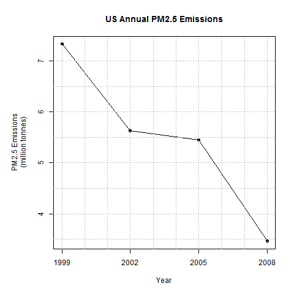
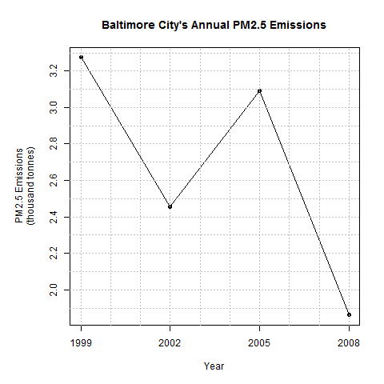
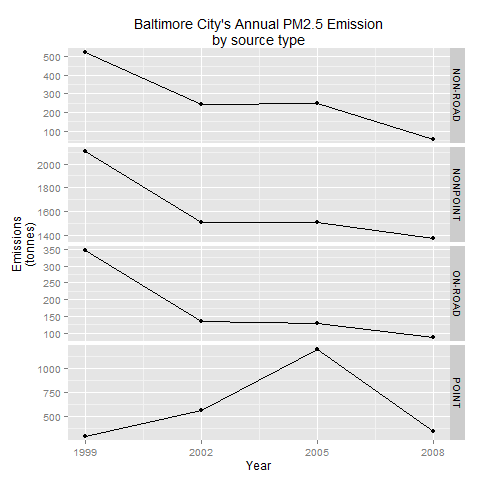
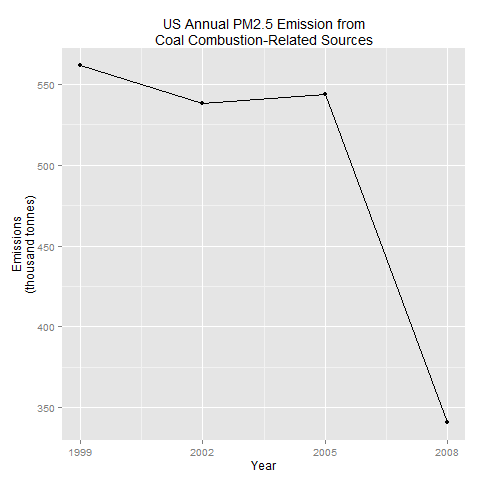
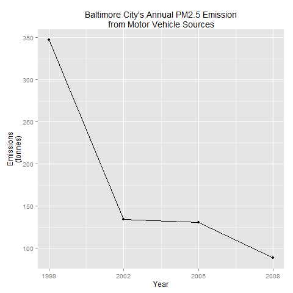
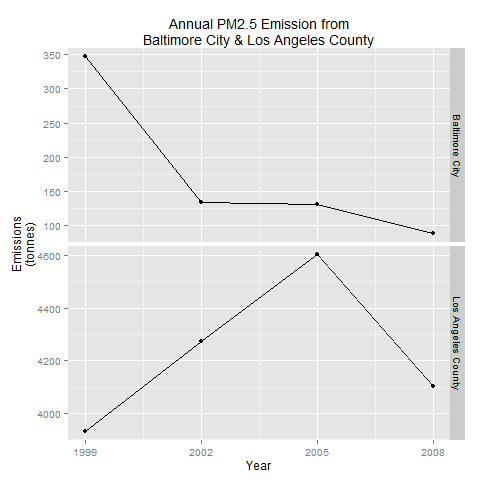

# Course Project 2: PM2.5 Pollution

## Description
This is an assignment to test the ability to choose what graphs to plot & also ability to use ggplot & base plot.  
We were asked to plot graphs which illustrate certain trends, sometimes in a specific plotting system.  
The exact layout of the graphs is not specified & sometimes you have to decide between multi-panel plots or several lines in a single axis.  

## Files
`plot%d.R` - R code to replicate specified plots  
`plot%d.png` - png image of specified plots / output of `plot%d.R`  
`Instructions.md` - Full instructions for assignment  

## Plots
`plot1` - Total US Emissions (base plot)  
  

`plot2` - Baltimore City Total Emissions (base plot)  
  

`plot3` - Baltimore City Emissions by Source Type (ggplot) 
  

`plot4` - US Emissions due to Coal Combustion  
  

`plot5` - Baltimore City Motor Vehicular Emissions  
  

`plot6` - Motor Vehicular Emissions from Baltimore City & Los Angeles  
  