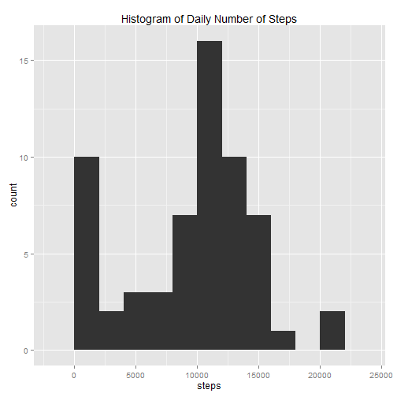
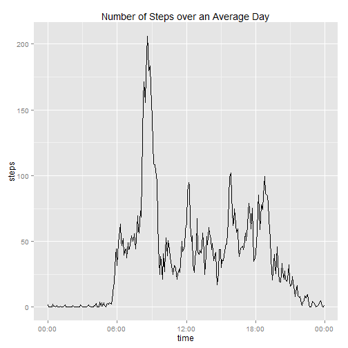
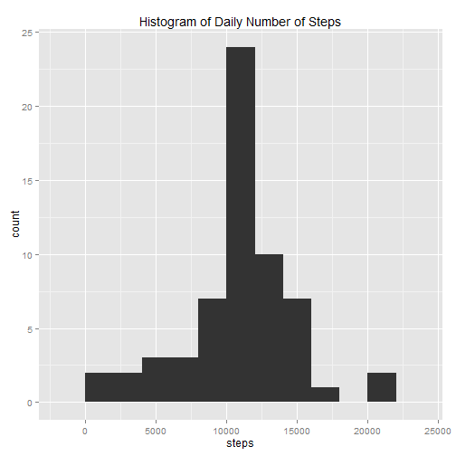
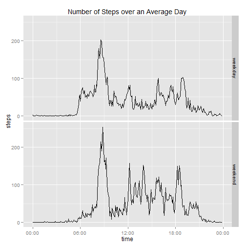

# Reproducible Research: Peer Assessment 1
by [Billy.Ljm](http://billyljm.wordpress.com/)  
12 August 2014  

## Introduction
This is my submission for the Peer Assesment 1 for the August 2014 version of the MOOC ["Reproducible Research" - John Hopkins Univeristy](https://www.coursera.org/course/repdata). We were given data from an anonymous individual's personal activity monitoring device, and were required to write codes which accomplished certain tasks. However, all the code must be written in this Rmd file (or the Rmd file this document was translated from). A copy of the data used is in the attached `activity.zip`. Alternatively, you can download a new copy from [here](https://d396qusza40orc.cloudfront.net/repdata%2Fdata%2Factivity.zip).  

## Required Packages
The R packages used & the reason I used them are as below.  

```r
require(data.table) # faster than data.frame
require(ggplot2) # personal preference
require(scales) # to format axes when plotting dateTime
require(plyr) # for ddpply 
```


## Loading and preprocessing the data

### 1. Load the data  

```r
unzip("activity.zip")
data <- fread("activity.csv", sep = ",", header = TRUE, na.strings = "NA", 
			  colClasses = c("numeric", "character", "numeric"))
head(data)
```

```
##    steps       date interval
## 1:    NA 2012-10-01        0
## 2:    NA 2012-10-01        5
## 3:    NA 2012-10-01       10
## 4:    NA 2012-10-01       15
## 5:    NA 2012-10-01       20
## 6:    NA 2012-10-01       25
```

### 2. Process the data    
The format I have chosen are:  

* steps = numeric  
* date = IDate  
* interval = ITime  


```r
data$date <- as.IDate(data$date, format = "%Y-%m-%d")
data$interval <- as.ITime(sprintf("%04d", data$interval), format = "%H%M")
head(data)
```

```
##    steps       date interval
## 1:    NA 2012-10-01 00:00:00
## 2:    NA 2012-10-01 00:05:00
## 3:    NA 2012-10-01 00:10:00
## 4:    NA 2012-10-01 00:15:00
## 5:    NA 2012-10-01 00:20:00
## 6:    NA 2012-10-01 00:25:00
```


## What is mean total number of steps taken per day

### 0. Create a new data.table for total steps taken every day 

```r
dailySteps_data <- ddply(data, .(date), summarise, steps = sum(steps, na.rm = TRUE))
head(dailySteps_data)
```

```
##         date steps
## 1 2012-10-01     0
## 2 2012-10-02   126
## 3 2012-10-03 11352
## 4 2012-10-04 12116
## 5 2012-10-05 13294
## 6 2012-10-06 15420
```

### 1. Plot a histogram of the steps taken each day.  

```r
ggplot(dailySteps_data, aes(x = steps)) + geom_histogram(binwidth = 2000) + 
	ggtitle("Histogram of Daily Number of Steps")
```

 

### 2. Calculate the mean & median steps taken per day.  

```r
dailySteps_mean <- mean(dailySteps_data$steps)
sprintf("mean: %f", dailySteps_mean)
```

```
## [1] "mean: 9354.229508"
```


```r
dailySteps_median <- median(dailySteps_data$steps)
sprintf("median: %d", dailySteps_median)
```

```
## [1] "median: 10395"
```


## What is the average daily activity pattern?

### 0. Create a new data.table for mean steps taken at each time of day

```r
intervalSteps_data <- ddply(data, .(interval), summarise, steps = mean(steps, na.rm = TRUE))
head(intervalSteps_data)
```

```
##   interval   steps
## 1 00:00:00 1.71698
## 2 00:05:00 0.33962
## 3 00:10:00 0.13208
## 4 00:15:00 0.15094
## 5 00:20:00 0.07547
## 6 00:25:00 2.09434
```

### 1. Plot a line graph of the mean number of steps for each interval

```r
# plotting ITime requires converting to POSIXct & then formatting to display time only 
ggplot(intervalSteps_data, aes(x = as.POSIXct(interval), y = steps)) + geom_line() + 
	scale_x_datetime(labels = date_format("%H:%M")) + xlab("time") +
	ggtitle("Number of Steps over an Average Day")
```

 

### 2. Which interval contains the maximum mean number of steps?

```r
maxIndx <- which.max(intervalSteps_data$steps)
intervalSteps_data[maxIndx, "interval"]
```

```
## [1] "08:35:00"
```


## Imputing missing values

### 1. Calculate the number of rows with missing values in the dataset

```r
sum(!complete.cases(data))
```

```
## [1] 2304
```

### 2. Devise a strategy to fill in all the missing values
I'll fill the missing values with the rounded mean of the 5-minute interval, with `intervalSteps_data` from the previous section.  

### 3. Create a new dataset with the missing data filled in.
The data provided only has missing values in `steps`. Thus, the code doesn't attempt to fill in _(non-existent)_ missing values in `date` & `time`.  

```r
missingValues_data <- data
# use intervalSteps_data to map from interval to steps (for NA values)
missingValues_data[is.na(steps)]$steps <- 
	lapply(missingValues_data[is.na(steps)]$interval, function(x) 
		round(intervalSteps_data[intervalSteps_data$interval == x, "steps"]))
head(missingValues_data)
```

```
##    steps       date interval
## 1:     2 2012-10-01 00:00:00
## 2:     0 2012-10-01 00:05:00
## 3:     0 2012-10-01 00:10:00
## 4:     0 2012-10-01 00:15:00
## 5:     0 2012-10-01 00:20:00
## 6:     2 2012-10-01 00:25:00
```

### 4a. Plot a histogram of the number of steps taken each day

```r
# Same method as previous histogram
missingValues_dailySteps <- ddply(missingValues_data, .(date), summarise, steps = sum(steps, na.rm = T))
ggplot(missingValues_dailySteps, aes(x = steps)) + geom_histogram(binwidth = 2000) + 
	ggtitle("Histogram of Daily Number of Steps")
```

 

### 4b. Calculate the mean and median number of steps taken per day

```r
missingValues_mean <- mean(missingValues_dailySteps$steps)
sprintf("mean: %f", missingValues_mean)
```

```
## [1] "mean: 10765.639344"
```


```r
missingValues_median <- median(missingValues_dailySteps$steps)
sprintf("median: %d", missingValues_median)
```

```
## [1] "median: 10762"
```

### 4c. Do these values differ from the first part of the assignment? 
Yes, the mean & median of the filled-in data differs from the raw data.

```r
missingValues_mean == dailySteps_mean
```

```
## [1] FALSE
```

```r
missingValues_median == dailySteps_median
```

```
## [1] FALSE
```

### 4d. What is the impact of inputing missing data?
In the raw data, they were several days where most intervals had missing values. This caused these days to have a very low number of steps as the missing values were considered to be zero. However, after inputing the missing data, such days have a number of steps similar to the average day. This resulted in a very significant decrease in the number of days with extremely low number of steps.


## Are there differences between weekdays and weekends?

### 1. Create a new factor variable of wether it is a weekday/weekend

```r
wday_data <- missingValues_data
wday_data$wday <- ifelse(wday(wday_data$date) < 6, "weekday", "weekend")
wday_data$wday <- as.factor(wday_data$wday)
head(wday_data)
```

```
##    steps       date interval    wday
## 1:     2 2012-10-01 00:00:00 weekday
## 2:     0 2012-10-01 00:05:00 weekday
## 3:     0 2012-10-01 00:10:00 weekday
## 4:     0 2012-10-01 00:15:00 weekday
## 5:     0 2012-10-01 00:20:00 weekday
## 6:     2 2012-10-01 00:25:00 weekday
```

### 2. Make a multi-panel plot of the mean steps taken for each interval

```r
wday_intervalSteps <- ddply(wday_data, .(interval, wday), summarise, steps = mean(steps, na.rm = TRUE))
ggplot(wday_intervalSteps, aes(x = as.POSIXct(interval), y = steps)) + geom_line() + 
	scale_x_datetime(labels = date_format("%H:%M")) + xlab("time") +
	ggtitle("Number of Steps over an Average Day") + facet_grid(wday~.)
```

 
